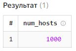
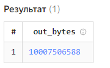

Использование технологии Yandex Query для анализа данных сетевой
активности №1
================

## Цель работы

1.Изучить возможности технологии Yandex Query для анализа
структурированных наборов данных 2. Получить навыки построения
аналитического пайплайна для анализа данных с помощью сервисов Yandex
Cloud 3. Закрепить практические навыки использования SQL для анализа
данных сетевой активности в сегментированной корпоративной сети

## Исходные данные

-   Windows 11
-   RStudio
-   Yandex Cloud
-   Yandex Query

## Общая ситуация

Вам стали доступны данные сетевой активности в корпоративной сети
компании XYZ. Данные хранятся в Yandex Object Storage. Проведите
разведочный анализ данных и ответьте на вопросы.

## Задание

Используя сервис Yandex Query настроить доступ к данным, хранящимся в
сервисе хранения данных Yandex Object Storage. При помощи
соответствующих SQL запросов ответить на вопросы.

## Ход работы

### 1. Проверить доступность данных в Yandex Object Storage

Проверяем доступность по ссылке

https://storage.yandexcloud.net/arrow-datasets/yaqry_dataset.pqt

Скачивается файл yaqry_dataset.pqt

### 2. Подключить бакет как источник данных для Yandex Query

Переходим в сервис Yandex Query - IDE - Соединения Создаем соединение со
следующими параметрами

-   Имя: lamzin-0120
-   Бакет: arrow-datasets
-   Аутентификация бакета: Публичный

Параметры привязки к данным

-   Имя: lamzin1
-   Путь: yaqry_dataset.pqt
-   Формат: parquet
-   Формат TIMESTAMP: UNIX_TIME_MICROSECONDS

Используем данные, представленные в задании для заполнения колонок

SCHEMA=(

timestamp TIMESTAMP NOT NULL,

src STRING,

dst STRING,

port INT32,

bytes INT32

)

Проверяем, что все создано верно, выполняя запрос


## Анализ

### 1. Известно, что IP адреса внутренней сети начинаются с октетов, принадлежащих интервалу \[12-14\]. Определите количество хостов внутренней сети, представленных в датасете.

Запрос:

``` sql
SELECT COUNT(DISTINCT ip_address) AS num_hosts
    FROM (SELECT src AS ip_address
        FROM `lamzin1`
            WHERE src REGEXP '(^1[2-4].)');
```

Результат:



### 2. Определите суммарный объем исходящего трафика

Запрос:

``` sql
SELECT SUM(bytes) AS out_bytes
    FROM `lamzin1`
        WHERE src REGEXP '(^1[2-4].)';
```

Результат:



### 3. Определите суммарный объем входящего трафика

Запрос:

``` sql
SELECT SUM(bytes) AS out_bytes
    FROM `lamzin1`
        WHERE dst REGEXP '(^1[2-4].)';
```

Результат:


``` r
print("done")
```

    [1] "done"

## Оценка результатов

Был подлючен и настроен бакет для запросов Yandex Query, было определено
количетсво хостов во внутренней сети, их суммарный исходящий и входящий
трафик

## Вывод

Поставленная задача была выполнена с использованием инструментов Yandex
Query и RStudio. В процессе решения задачи был приобретен опыт работы
анализа данных с использованием языка SQL
