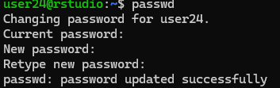

# Использование технологии Yandex Query для анализа данных сетевой
активности №1

## Цель работы

1.  Изучить возможности технологии Apache Arrow для обработки и анализ
    больших данных
2.  Получить навыки применения Arrow совместно с языком программирования
    R
3.  Получить навыки анализа метаинфомации о сетевом трафике
4.  Получить навыки применения облачных технологий хранения, подготовки
    и анализа данных: Yandex Object Storage, Rstudio Server.

## Исходные данные

-   Windows 11
-   RStudio
-   Yandex Object Storage
-   Apache Arrow

## Общая ситуация

Вы – специалист по информационной безопасности компании “СуперМегатек”.
Вы, являясь специалистом Threat Hunting, часто используете информацию о
сетевом трафике для обнаружения подозрительной и вредоносной активности.
Помогите защитить Вашу компанию от международной хакерской группировки
AnonMasons.

У Вас есть данные сетевой активности в корпоративной сети компании
“СуперМегатек”. Данные хранятся в Yandex Object Storage.

## Задание

Используя язык программирования R, библиотеку arrow и облачную IDE
Rstudio Server, развернутую в Yandex Cloud, выполнить задания и
составить отчет

## Задачи

Задание 1: Надите утечку данных из Вашей сети Задание 2: Надите утечку
данных 2 Задание 3: Надите утечку данных 3

## Ход работы

Устанавливаем SSH-туннель командой:

RStudio Server user - user24

    ssh -i "C:\Users\alexk\OneDrive\Рабочий стол\rstudio.key" -L 8787:127.0.0.1:8787 user24@62.84.123.211

Меняем стандартный пароль:



Переходим по адресу

http://127.0.0.1:8787/

Входим в аккаунт, используя новый пароль


Загружаем библиотеку

``` r
library(dplyr)
```


    Attaching package: 'dplyr'

    The following objects are masked from 'package:stats':

        filter, lag

    The following objects are masked from 'package:base':

        intersect, setdiff, setequal, union

``` r
library(lubridate)
```


    Attaching package: 'lubridate'

    The following objects are masked from 'package:base':

        date, intersect, setdiff, union

``` r
library(arrow)
```

    Some features are not enabled in this build of Arrow. Run `arrow_info()` for more information.


    Attaching package: 'arrow'

    The following object is masked from 'package:lubridate':

        duration

    The following object is masked from 'package:utils':

        timestamp

``` r
library(tidyverse)
```

    ── Attaching core tidyverse packages ──────────────────────── tidyverse 2.0.0 ──
    ✔ forcats 1.0.0     ✔ stringr 1.5.1
    ✔ ggplot2 3.4.4     ✔ tibble  3.2.1
    ✔ purrr   1.0.2     ✔ tidyr   1.3.1
    ✔ readr   2.1.5     

    ── Conflicts ────────────────────────────────────────── tidyverse_conflicts() ──
    ✖ arrow::duration() masks lubridate::duration()
    ✖ dplyr::filter()   masks stats::filter()
    ✖ dplyr::lag()      masks stats::lag()
    ℹ Use the conflicted package (<http://conflicted.r-lib.org/>) to force all conflicts to become errors

Загружаем датасет

``` r
curl::multi_download(
  "https://storage.yandexcloud.net/arrow-datasets/tm_data.pqt",
  "tm_data.pqt",
  resume = TRUE
)
```

    # A tibble: 1 × 10
      success status_code resumefrom url    destfile error type  modified
      <lgl>         <int>      <dbl> <chr>  <chr>    <chr> <chr> <dttm>  
    1 TRUE            416          0 https… /home/u… <NA>  appl… NA      
    # ℹ 2 more variables: time <dbl>, headers <list>

Смотрим датасет

``` r
data <- arrow::open_dataset(sources = "tm_data.pqt", format  = "parquet")
data %>% glimpse()
```

    FileSystemDataset with 1 Parquet file
    105,747,730 rows x 5 columns
    $ timestamp <double> 1.578326e+12, 1.578326e+12, 1.578326e+12, 1.578326e+12, 1.5…
    $ src       <string> "13.43.52.51", "16.79.101.100", "18.43.118.103", "15.71.108…
    $ dst       <string> "18.70.112.62", "12.48.65.39", "14.51.30.86", "14.50.119.33…
    $ port       <int32> 40, 92, 27, 57, 115, 92, 65, 123, 79, 72, 123, 123, 22, 118…
    $ bytes      <int32> 57354, 11895, 898, 7496, 20979, 8620, 46033, 1500, 979, 103…
    Call `print()` for full schema details

Приводим тип данных колонки *timestamp* к формату времени и даты

``` r
data <- data %>%
  mutate(timestamp = as_datetime(timestamp/1000, origin = "1970-01-01", tz = "UTC"))
```

``` r
data %>% glimpse()
```

    FileSystemDataset with 1 Parquet file (query)
    105,747,730 rows x 5 columns
    $ timestamp <timestamp[ns, tz=UTC]> 2020-01-06 16:09:39, 2020-01-06 16:09:39, 20…
    $ src                      <string> "13.43.125.31", "14.51.39.122", "16.93.91.90…
    $ dst                      <string> "14.55.60.84", "13.43.122.93", "12.36.36.112…
    $ port                      <int32> 90, 74, 37, 119, 68, 92, 119, 121, 117, 52, …
    $ bytes                     <int32> 42, 40274, 52479, 50334, 1143, 3773, 31897, …
    Call `print()` for query details

### Задание 1: Надите утечку данных из Вашей сети

Важнейшие документы с результатами нашей исследовательской деятельности
в области создания вакцин скачиваются в виде больших заархивированных
дампов. Один из хостов в нашей сети используется для пересылки этой
информации – он пересылает гораздо больше информации на внешние ресурсы
в Интернете, чем остальные компьютеры нашей сети. Определите его
IP-адрес

``` r
result <- data %>%
  filter(grepl("^12\\.|^13\\.|^14\\.", src)) %>%
  group_by(src) %>%
  summarise(total_bytes = sum(bytes)) %>%
  arrange(desc(total_bytes)) %>%
  head(1)
src1 <- result %>% collect()

src1$src
```

    [1] "13.37.84.125"

### Задание 2: Надите утечку данных 2

Другой атакующий установил автоматическую задачу в системном
планировщике cron для экспорта содержимого внутренней wiki системы. Эта
система генерирует большое количество трафика в нерабочие часы, больше
чем остальные хосты. Определите IP этой системы. Известно, что ее IP
адрес отличается от нарушителя из предыдущей задачи.

``` r
data_local <- collect(data)
data_local <- data_local %>%
  mutate(hour = hour(as.POSIXlt(timestamp, origin = "1970-01-01", tz = "UTC")))
```

Поиск рабочих часов (16:00-24:00)

``` r
work_time <- data_local %>%
  group_by(hour) %>%
  summarise(traffic = sum(bytes)) %>%
  arrange(traffic)
work_time
```

    # A tibble: 24 × 2
        hour     traffic
       <int>       <dbl>
     1     5 10296318981
     2    15 10297437556
     3    11 10306926607
     4    10 10320411897
     5     1 10324774067
     6     0 10338294625
     7     3 10339156776
     8     9 10339532889
     9     6 10341154093
    10     4 10342139110
    # ℹ 14 more rows

``` r
data2 <- collect(data)
result <- data2 %>%
  filter(grepl("^12\\.|^13\\.|^14\\.", src)) %>%
  filter(between(hour(timestamp), 0, 16)) %>%
  filter(!str_detect(src, "^13.37.84.125$")) %>%
  group_by(src) %>%
  summarise(sum_traffic = sum(bytes)) %>%
  arrange(desc(sum_traffic)) %>%
  head(1)
src2 <- result %>% collect()
src2$src
```

    [1] "12.55.77.96"

### Задание 3: Надите утечку данных 3

Еще один нарушитель собирает содержимое электронной почты и отправляет в
Интернет используя порт, который обычно используется для другого типа
трафика. Атакующий пересылает большое количество информации используя
этот порт, которое нехарактерно для других хостов, использующих этот
номер порта. Определите IP этой системы. Известно, что ее IP адрес
отличается от нарушителей из предыдущих задач.

``` r
average_traffic <- data %>%
  filter(grepl("^12\\.|^13\\.|^14\\.", src)) %>%
  group_by(port) %>%
  summarise(avg_traffic = mean(bytes)) %>%
  collect()

max_traffic <- data %>%
  filter(grepl("^12\\.|^13\\.|^14\\.", src)) %>%
  group_by(port) %>%
  summarise(max_traffic = max(bytes)) %>%
  collect()

result <- data %>%
  filter(grepl("^12\\.|^13\\.|^14\\.", src)) %>%
  filter(!str_detect(src, "^13.37.84.125$")) %>%
  filter(!str_detect(src, "^12.55.77.96$")) %>%
  group_by(src, port) %>%
  summarise(total_traffic = sum(bytes)) %>%
  left_join(average_traffic, by = "port") %>%
  left_join(max_traffic, by = "port") %>%
  mutate(traffic_ratio = total_traffic / avg_traffic) %>%
  collect()

result %>%
  head(1)
```

    # A tibble: 1 × 6
    # Groups:   src [1]
      src          port total_traffic avg_traffic max_traffic traffic_ratio
      <chr>       <int>         <int>       <dbl>       <int>         <dbl>
    1 14.42.45.48   115      66936506      33341.      202787         2008.

``` r
src3 <- result$src[1]
src3
```

    [1] "14.42.45.48"

## Оценка результатов

Были найдены утечки данных из сети

## Вывод

Поставленная задача была выполнена с использованием инструментов Apache
Arrow и RStudio. В процессе решения задачи был приобретен опыт работы по
нахождению утечек данных
